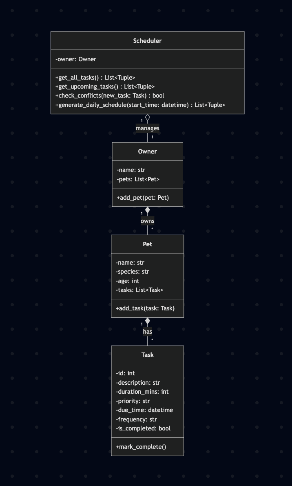

# PawPal+ Project Reflection

## 1. System Design

**a. Initial design**

- Briefly describe your initial UML design.

Owner holds the user's basic information and a list of their pets.

Pet represents individual animals and owns a specific list of care tasks.

Task is the data structure for the actual chores, storing constraints like duration, priority, and frequency.

Scheduler aggregates all tasks from all pets and contains algorithms to sort them, detect overlaps, and generate the final daily plan.

- What classes did you include, and what responsibilities did you assign to each?
Task: Tracks properties like description, duration_mins, frequency, and is_completed.

Pet: Holds the pet's profile and a list of their specific tasks.

Scheduler: Acts as the brain storing multiple pets and defining placeholders for important logic like check_conflicts, get_upcoming_tasks, and generate_recurring_tasks.

- Core actions:
Add and edit profiles: A user needs to be able to enter basic information 
about themselves and their pet, such as the pet's name, species, and age.

Add and edit tasks: A user must be able to input specific care activities 
(e.g., walking, feeding, grooming) and define their constraints, primarily the 
task's duration in minutes and its priority level.

Generate schedule: A user should be able to click a button to generate a daily 
plan. The system will then automatically choose and order the tasks based on the 
provided constraints and priorities, and display the resulting schedule clearly.

**b. Design changes**

- Did your design change during implementation?

Yes, the design changed during implementation.

- If yes, describe at least one change and why you made it.

Initially, the skeleton had basic classes with empty methods and no explicit relationships between tasks and scheduled times. During implementation, I added a `pet_id` back-reference in `Task` and a `start_time` field to enable proper scheduling and querying. I also introduced a new `Calendar` class to centralize time management and conflict detection, as the original `Scheduler` lacked efficient data structures for handling overlaps. These changes were necessary to fix missing relationships (e.g., tasks not linked to pets beyond lists) and prevent logic bottlenecks (e.g., O(n) conflict checks becoming inefficient with many tasks), ensuring the system could scale and handle recurring tasks without manual workarounds.

---

## 2. Scheduling Logic and Tradeoffs

**a. Constraints and priorities**

- What constraints does your scheduler consider (for example: time, priority, preferences)?
- How did you decide which constraints mattered most?

**b. Tradeoffs**

- Describe one tradeoff your scheduler makes.

The scheduler uses a simple greedy algorithm that assigns tasks sequentially based on priority and due time, without backtracking to find optimal schedules. This may lead to suboptimal arrangements if higher-priority tasks could be swapped for better fits.

- Why is that tradeoff reasonable for this scenario?

This tradeoff is reasonable for pet care scheduling because simplicity and speed are prioritized over perfection. Pet owners typically have small numbers of tasks, so the greedy approach is fast and easy to understand, avoiding complex optimizations that could confuse users or slow down the app.

---

## 3. AI Collaboration

**a. How you used AI**

- How did you use AI tools during this project (for example: design brainstorming, debugging, refactoring)?
- What kinds of prompts or questions were most helpful?

**b. Judgment and verification**

- Describe one moment where you did not accept an AI suggestion as-is.
- How did you evaluate or verify what the AI suggested?

---

## 4. Testing and Verification

**a. What you tested**

- What behaviors did you test?

I tested core behaviors including task completion (marking tasks done), task addition to pets, sorting tasks by due time, automatic creation of next recurring task instances upon completion, and conflict detection for overlapping scheduled tasks.

- Why were these tests important?

These tests were important to verify that the fundamental scheduling logic works correctly, ensuring users can rely on the app for accurate pet care planning. They catch bugs early, prevent regressions during updates, and validate edge cases like sorting with missing times or handling recurring tasks, which are critical for a reliable pet scheduling system.

**b. Confidence**

- How confident are you that your scheduler works correctly?

I am highly confident (4/5) that the scheduler works correctly for typical use cases, as the tests cover key paths and edge cases, and manual runs in main.py confirm expected outputs.

- What edge cases would you test next if you had more time?

If I had more time, I would test edge cases like handling a large number of tasks (e.g., 50+ per pet) for performance, complex recurring patterns (e.g., bi-weekly or custom frequencies), time zone differences, tasks spanning midnight, and integration with the Streamlit UI for real-time updates.

---

## 5. Reflection

**a. What went well**

- What part of this project are you most satisfied with?

**b. What you would improve**

- If you had another iteration, what would you improve or redesign?

**c. Key takeaway**

- What is one important thing you learned about designing systems or working with AI on this project?
